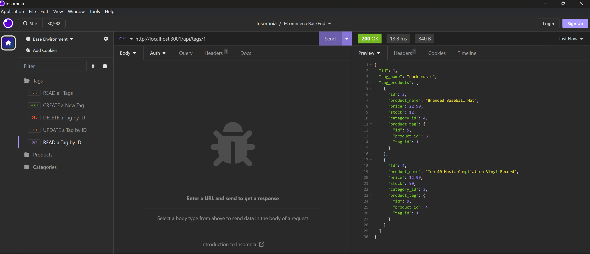

# E-Commerce Back End

## Description

  This project offers the (almost) complete back end of an inventory management app for a small online retail store. By carefully defining the basic routes that such an API would possess, we give potential users the flexibility of adding additional routes and implementing the front end that will serve them best. We divide the routes into three types, each corresponding to a JS class: categories, products and tags.
  The classes have the following pairwise relations:

  1. Each product belongs to a category.

  2. Categories serve to classify many products.

  3. For each product there are various tags attached to it, describing some feature they have.

  4. Each tag can be attached to many products.

  With the purpose of showing functionality, some seeding files were included as part of the package to be used as sample data.

  Considered as an exercise in coding, this projects allows to practice using packages such as:
  
  1. "DotEnv" to define environemental variables that protect sensitive configuration information that will vary among deployments.

  2. "Express.js" in order to be able to instantiate a server and routers for the GET, POST, PUT, and DELETE routes defined for each endpoint.

  3. "Sequelize" to use ORM, synchronizing models (implemented as JS classes) to the database and make queries to it using scripts instead of SQL statements.

  We have continued developing the modularization/separation of concerns that have been one of the pillars of our incursion into back end development within the Node runtime environment and practice defining RESTful routes.

## Table of Contents

- [Installation](#installation)
- [Usage](#usage)
- [Credits](#credits)
- [License](#license)

## Installation

1. Go to the CLI of Git BASH and use the "mkdir" command to create a new directory for the folder. Use the "cd" command to change directory.

2. Navigate to <https://github.com/jguemarez/ECommerceBackEnd>, press the "<> Code" button, choose the most convenient way to clone the repo, and copy the direction.

3. Go back to Git BASH and append the copied direction to the command "git clone" .

4. Enter whathever means of authorization (e.g. a passphrase for SSH Keys) they ask you.

5. Once cloning is done, go to the MySQL Shell in order to run the command "SOURCE db/schema.sql;". That will create the new database for you.

6. Change the name of the "$.env.Example" file to .env and save the data needed to create a "sequelize" configuration in the environmental variables whose identifiers are provided in the file.

7. Within Git BASH, run "npm install" to install the dependencies in the package.json file.

8. Enter "npm run seed" in order to seed the database, i.e., create the tables onto which the Sequelize models map and populate them.

9. Enter "npm start" so as to synchronize the Sequelize models with the ecommerce_db and have the Express server listening at the port stipulated in the "server.js" file. Once the message
"App listening on port ${port}!" appears in the terminal, you can start testing the routes, some of them in the browser of your choice while others will require an API platform like"PostMan"/"Insomnia".

## Usage

NB: Since this project consists only of the back-end (server-side) part of a would-be website/API, in order to test the routes that require a request body (the Post and Put routes)the user will need to use API platform software like  "Insomnia" v 2023.5.8. The screenshots show that particular API platform in use and  is what we use to prove functionality in the walkthrough video whose link is in the "Credits" section. Henceforth, ":id" denotes a route parameter. It accepts positive integers as values. The POST and PUT routes require passing a JSON string of the appropriate form to be parsed into a JS object using middleware defined in "server.js" and passed as part of the body of the request (req.body).

1. Using "Insomnia", we can organize our routes for each table as shown below:

2. If we make a GET request to "/api/categories", we get:

3. If we make a GET request to "/api/categories/:id" , we get:

4. If we make a POST request to "api/categories", we get:

5. If we make a PUT request to "api/categories/:id", we get:

 

6. If we make a DELETE request to "api/categories/:id", we get:

7. If we make a GET request to "/api/products", we get:

8. If we make a GET request to "/api/products/:id" we get:

9. If we make a POST request to "api/products", we get:

10. If we make a PUT request to "api/products/:id", we get:

11. If we make a DELETE request to "api/products/:id", we get:

12. If we make a GET request to "/api/tags", we get:

13. If we make a GET request to "/api/tags/:id" , we get:

14. If we make a POST request to "api/tags", we get:

15. If we make a PUT request to "api/tags/:id", we get:

16. If we make a DELETE request to "api/tags/:id", we get:

17. If we try to access any other endpoint, using any method, we get:

## Credits

The project is of the authorship of Jonathan Maldonado.The GitHub repo can be found at: <https://github.com/jguemarez/ECommerceBackEnd> .

The walkthrough video showing the functionality of the defined routes can be found in Google Drive at: <https://watch.screencastify.com/v/NPiQR4HkMYua2D0BpLiN>

The .gitignore file was lifted from the GitLab class repo found at: <https://git.bootcampcontent.com>.

The starter code for the app can be found at:  <https://github.com/coding-boot-camp/fantastic-umbrella>

It provides most of the folder structure for the project (minus the "assets" folder ). In terms of coding style and modularization, we have taken inspiration from the activities and Mini-Project for the Module 13 of the Rutgers Full Stack Bootcamp.

This app works in the Node.js JavaScript runtime environment. The latest stable (recommended version) can be found at: <https://nodejs.org/en/download>

We use npm for the specification (semantic versioning) of the app's dependencies and their installation. Here is the URL for the official site of the npm registry: <https://www.npmjs.com>
Here are the dependencies for the development and production environments that we added, including links to find their most recent versions:

Dev-dependencies:

1. Nodemon: "^2.0.3". Used to continuously track the changes to the .js and .json file while coding and debugging, so as not to have to manually stop and restart the express server from listening at the designated port after each change.
<https://www.npmjs.com/package/nodemon>

Dependencies:

1. Express: "^4.17.1". In order to create and work with servers, middleware, routers, etc.
<https://www.npmjs.com/package/express>

2. DotEnv: "^8.2.0". Employed so that we can configure our connections to the database without hardcoding sensititive information that could get compromised by storing the data in environmental variables.
<https://www.npmjs.com/package/dotenv>

3. MySQL2: "^2.1.0". Used to create a connection to and make queries to the database without having to log to the MySQL shell and enter the queries through its CLI, but instead using scripts in JS files.
<https://www.npmjs.com/package/mysql2>

4. Sequelize:"^5.21.7". ORM (Object Relational Mapping) package that synchronizes JS (ES6 specification) classes to the database in order to perform CRUD operations in said database and establish associations(realations) between tables using scripts instead of SQL commands (unless we deem convenient or necessary to use literals).
<https://www.npmjs.com/package/sequelize>

## How to Contribute

If you want to contribute, feel free to fork the repo, modify the repo on your local machine and then open a pull request. That way I can review the changes before deciding whether to merge them in the codebase or not.

## Tests

The proposed back-end for a possible future inventory application for an e-commerce site has been tested using both the "Insomnia" API platform and the Google Chrome browser (for the routes that do not require a body for the request). For any bug that appears as the result of bad coding, feel free to open an issue in the projects' repo at GitHub.

## Questions

 For further questions and comments, you can mail them to the following address: <cantor.dedekind112358@gmail.com>.

## License

This is an open-source project under the terms of agreement provided by the MIT license.
  For more information, click on the following link: <https://opensource.org/license/mit>
